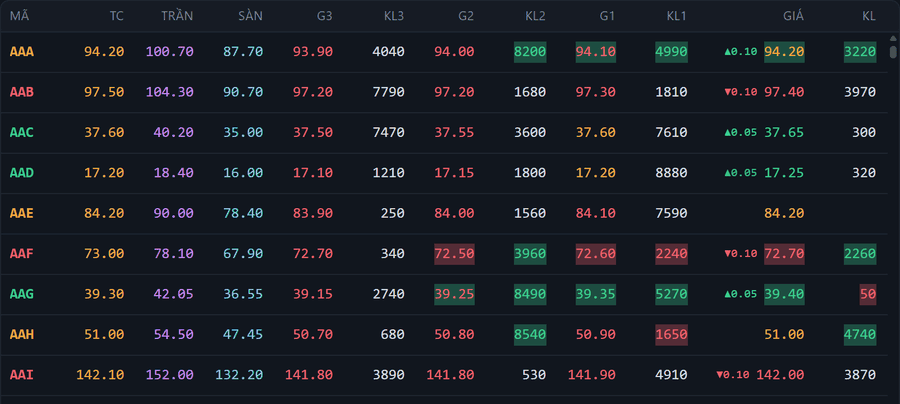
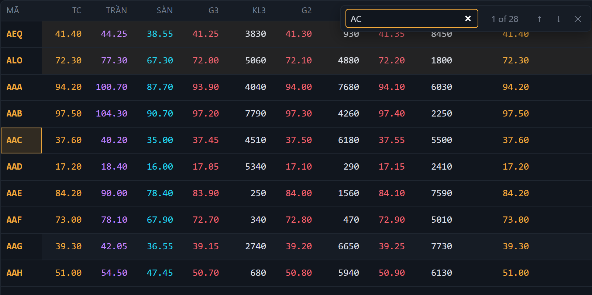
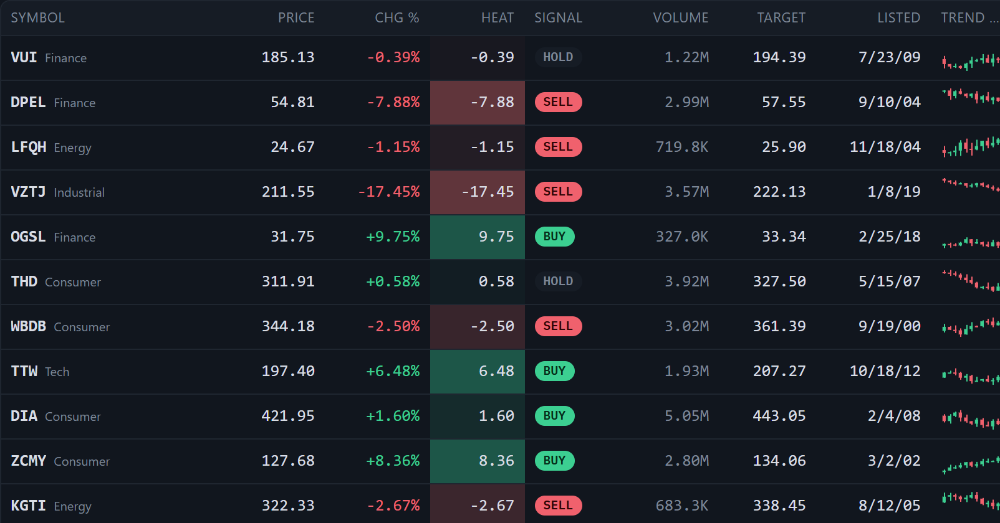
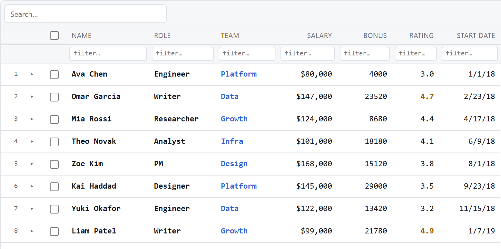

<div align="center">


# bo-grid

**The data grid for busy markets.**

A Svelte 5 data grid built for trading screens. Tens of thousands of ticks a
second land in one update a frame, and a thousand symbols scroll in
millisecond steps. Grouping, pivot, tree data and the rest come in the same
MIT package.

[](https://www.npmjs.com/package/bo-grid)
[](https://github.com/bonguynvan/bo-grid/actions/workflows/ci.yml)
[](./BENCHMARKS.md)
[](https://svelte.dev)
[](./src/lib/index.ts)
[](./LICENSE)

**[Live demo](https://bonguynvan.github.io/bo-grid/)** ·
**[Guide](./docs/guide.md)** ·
**[API reference](https://bonguynvan.github.io/bo-grid/api.html)** ·
**[Benchmarks](./BENCHMARKS.md)** ·
**[Changelog](./CHANGELOG.md)**



</div>

## Why bo-grid

- **Fast where it counts.** A 1,000-symbol, 24-column price board takes
  ~9 ms of main-thread work per frame at 10,000 events/s and ~12 ms at
  30,000, with every changed cell flashing (`flashMotion: 'hold'`). Ticks coalesce to one update a
  frame, and `api.patchRows` repaints only the cells that changed.
  [How it's measured →](./BENCHMARKS.md)
- **Trading-native.** Flashes on every tick, the size of each move, price-limit
  colours (ceiling, floor, reference), tick-aware formatting, session state, and
  order book, price ladder and time-and-sales helpers.
- **Everything in one package.** Grouping and subtotals, pivot, tree data,
  master-detail, range selection with a fill handle, clipboard, Excel export and
  sparklines. One install, no add-ons, no licence key.
- **Small and SSR-safe.** About 45 KB gzip core with no runtime dependencies,
  and it server-renders cleanly in SvelteKit.
- **Accessible.** A full keyboard model with grid / treegrid semantics. The
  demo is axe-clean for ARIA structure and colour contrast.
- **Any framework.** Native Svelte 5, plus a `<bo-grid>` custom element for
  React, Vue, Angular or plain JS.

## A look around

<table>
  <tr>
    <td width="50%"></td>
    <td width="50%"></td>
  </tr>
  <tr>
    <td><b>Pin the symbols you watch, find any of them with Ctrl/⌘+F.</b> Pinned rows keep updating above the scroll.</td>
    <td><b>Rich cells out of the box.</b> Heat maps, badges, sparklines and sub-labels are ready to use.</td>
  </tr>
  <tr>
    <td colspan="2"></td>
  </tr>
  <tr>
    <td colspan="2"><b>A spreadsheet when you need one.</b> Row numbers, filter row, typed editors, copy/paste, fill handle and undo, here in the light theme with columns that scale with the page.</td>
  </tr>
</table>

## Features

| | |
| --- | --- |
| **Realtime** | Tick flash (`fade`, or `hold` for busy boards) · size of each move (`showChange`) · on-demand flashes (`api.flashCells`) · in-place patches (`api.patchRows`) with a coalescing tick stream · stream only the rows on screen (`onViewportChange`) · live re-sort (`api.refresh`) |
| **Data** | Single and multi sort · text / number / date / set / custom filters · quick search · find in grid · grouping with sticky headers and subtotals · pivot · tree data (lazy too) · master-detail · server-side rows |
| **Editing** | Inline, typed and custom editors · validation · clipboard · fill handle · undo / redo |
| **Layout** | Pinned columns and rows · columns that scale (`fitColumns`) or widen as values grow (`autoWidth`) · resize, reorder, hide · header groups · merged cells · column virtualization · row numbers · pagination |
| **Look** | 8 theme presets and your own tokens · conditional formatting (data bars, icons, colour scales) · sparklines · column hover · localization |
| **Platform** | Keyboard and screen-reader support · SSR / SvelteKit · layout save and restore · CSV / Excel export and import · `<bo-grid>` custom element |

The [guide](./docs/guide.md) covers each of these with examples.

## Install

```sh
npm i bo-grid        # peer dependency: svelte@^5
```

## Quick start

```svelte
<script lang="ts">
  import { Grid, type ColumnDef } from 'bo-grid';

  const columns: ColumnDef[] = [
    { type: 'text',      key: 'symbol', header: 'Symbol', width: 110 },
    { type: 'price',     key: 'price',  header: 'Price',  width: 90, flash: 'auto', showChange: true },
    { type: 'percent',   key: 'change', header: 'Chg %',  width: 84 },
    { type: 'volume',    key: 'volume', header: 'Volume', width: 96, autoWidth: true },
    { type: 'sparkline', key: 'candles', sparkKey: 'candles', header: 'Trend', width: 140 },
  ];

  let rows = $state([/* { id, symbol, price, change, volume, candles } */]);
</script>

<Grid {rows} {columns} height={560} fitColumns findBar />
```

## The busy-market setup

Plain rows, a coalescing tick stream and in-place patches keep a full board
inside the frame budget. Held flashes keep each flash cheap, and viewport
subscriptions mean only the symbols on screen stream:

```svelte
<script lang="ts">
  import { Grid, type GridApi } from 'bo-grid';
  import { createTickStream, createViewportSubscriptions } from 'bo-grid/realtime';

  let rows = $state.raw(initialQuotes);           // plain objects, no deep proxy
  let api: GridApi;

  const stream = createTickStream({ apply: (batch) => api.patchRows(batch) });
  const subs = createViewportSubscriptions({
    key: (row) => row.symbol,
    subscribe: (syms) => socket.send(JSON.stringify({ op: 'sub', syms })),
    unsubscribe: (syms) => socket.send(JSON.stringify({ op: 'unsub', syms })),
  });
  socket.onmessage = (e) => { const q = JSON.parse(e.data); stream.push(q.symbol, q); };
  stream.start();
</script>

<Grid {rows} {columns} getRowId={(r) => r.symbol} flashMotion="hold" rowPinning
      onReady={(a) => (api = a)} onViewportChange={subs.update} />
```

More in the guide: [busy markets](./docs/guide.md#busy-markets--plain-rows--apipatchrows),
[market conventions](./docs/guide.md#market-conventions--bo-gridtrading),
[price ladder and time and sales](./docs/guide.md#price-ladder--time--sales).

## Other frameworks

```js
import 'bo-grid/element';                       // registers <bo-grid>

const grid = document.querySelector('bo-grid');
grid.config = { columns, rows, height: 520, theme: 'dark' };
```

React, Vue and Angular recipes are in [docs/frameworks.md](./docs/frameworks.md),
and build-free starters are in [examples/](./examples/).

## Documentation

- **[Guide](./docs/guide.md)**: every feature, with examples.
- **[API reference](https://bonguynvan.github.io/bo-grid/api.html)**: every
  prop, column option and export.
- **[SvelteKit](./docs/sveltekit.md)**: `load` data, SSR, lazy loading and
  layout persistence.
- **[Benchmarks](./BENCHMARKS.md)**: bundle size and live-board frame costs,
  and how to reproduce them.
- **[Accessibility](./ACCESSIBILITY.md)**: roles, keyboard model and contrast.
- **[Roadmap](./ROADMAP.md)** and **[Changelog](./CHANGELOG.md)**.
- **AI coding assistants:** point yours at
  [llms-full.txt](https://bonguynvan.github.io/bo-grid/llms-full.txt). It lists
  every real prop and export; see [docs/ai](./docs/ai) for editor rules.

## Contributing

Issues and pull requests are welcome. [CONTRIBUTING.md](./CONTRIBUTING.md)
covers the setup, the checks a change must pass, and how performance claims
are measured. Please follow the [code of conduct](./CODE_OF_CONDUCT.md), and
report security issues privately as described in [SECURITY.md](./SECURITY.md).

## Related

- **[TradeCanvas](https://github.com/bonguynvan/tradecanvas)**: canvas trading
  charts with indicators, drawing tools and real-time streaming. It is the
  chart half of the same toolkit; pair it with bo-grid for a full trading desk.

## License

[MIT](./LICENSE)
